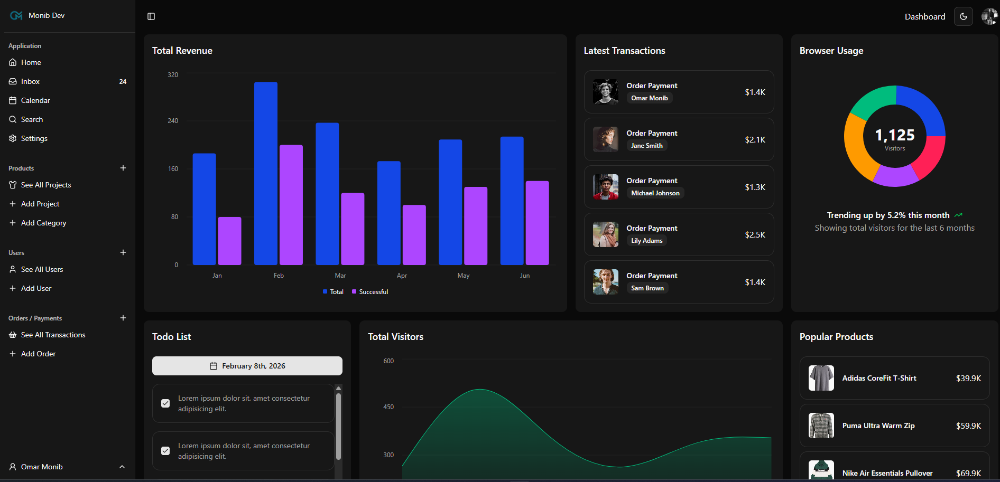
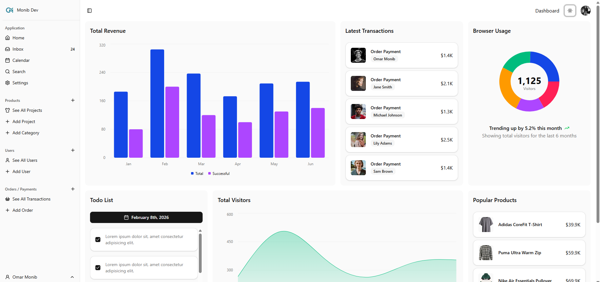
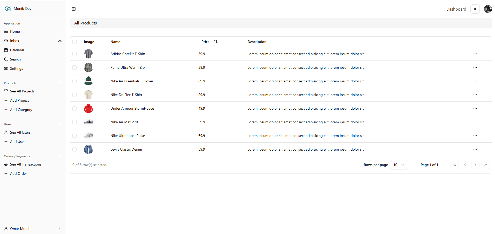
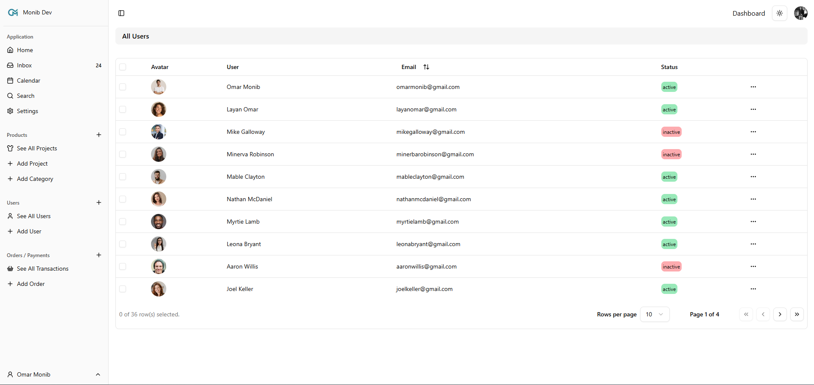
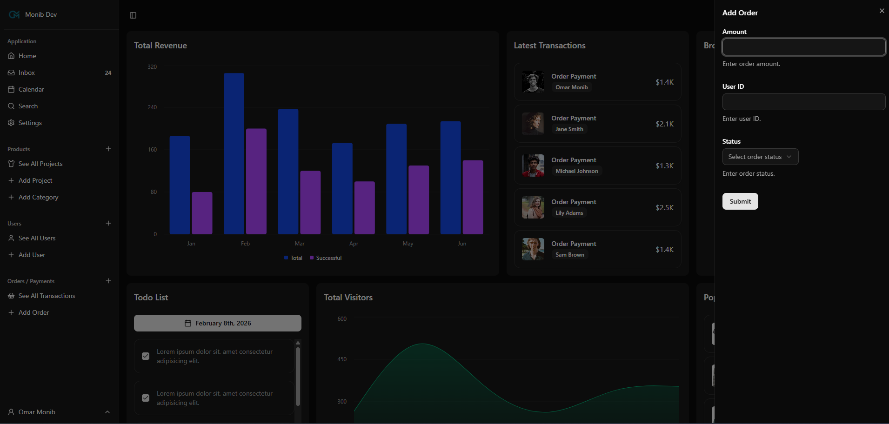
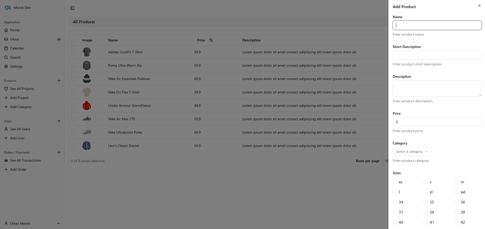
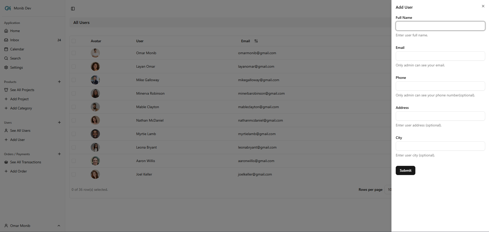

# E-Commerce Admin Dashboard

A production-ready e-commerce admin dashboard built with Next.js 14,
focused on scalability, clean architecture, and modern UI/UX.


## 📸 Screenshots

### Dashboard Dark Mode


### Dashboard Light Mode


### Products Management


### Users Management


### Orders



<details>
<summary>📸 More Screenshots</summary>

### Products



### Users



### Orders


</details>

## ✨ Features

- Manage products and inventory efficiently
- Track and process customer orders
- Control user roles and permissions
- Monitor sales and performance analytics
- Responsive admin interface for daily operations

### Technical Highlights
- Modern UI with dark/light mode
- Form validation with React Hook Form and Zod
- Advanced data tables with sorting and filtering
- Charts and visualizations built with Recharts


## 🚀 Tech Stack

- **Framework**: Next.js 14 (App Router)
- **UI Components**: shadcn/ui (Radix UI + Tailwind CSS)
- **Form Handling**: React Hook Form + Zod
- **Data Tables**: TanStack Table
- **Charts**: Recharts
- **Icons**: Lucide React
- **State Management**: React Context + Hooks
- **Styling**: Tailwind CSS
- **Type Safety**: TypeScript

## 📦 Prerequisites

- Node.js 18.17 or later
- npm, yarn, or pnpm
- Git

## 🔗 Live Demo
👉 https://admin-e-commerce-seven.vercel.app/

## 🛠️ Installation

1. Clone the repository:

   ```bash
   git clone https://github.com/omarmonib/Admin-Dashboard-E-Commerce.git
   cd Admin-Dashboard-E-Commerce
   ```

2. Install dependencies:

   ```bash
   pnpm install
   ```

3. Set up environment variables:
   Create a `.env.local` file in the root directory and add your environment variables:

   ```env
   NEXT_PUBLIC_API_URL=your_api_url_here
   # Add other environment variables as needed
   ```

4. Run the development server:

   ```bash
   npm run dev
   # or
   yarn dev
   # or
   pnpm dev
   ```

5. Open [http://localhost:3000](http://localhost:3000) in your browser to see the result.

## 🏗️ Project Structure
The project follows a scalable, feature-based structure:

```
src/
├── app/                  # App router pages
│   ├── dashboard/        # Dashboard pages
│   ├── products/         # Product management
│   ├── orders/           # Order management
│   └── customers/        # Customer management
├── components/           # Reusable UI components
│   ├── ui/               # shadcn/ui components
│   ├── forms/            # Form components
│   └── layout/           # Layout components
├── lib/                  # Utility functions
├── hooks/                # Custom React hooks
└── styles/               # Global styles
```
## 🎯 Why This Project?

This project was built to demonstrate real-world admin dashboard patterns,
including scalable architecture, reusable components, and data-heavy UI.

## 🔮 Future Improvements
- Authentication & authorization
- Real backend integration
- Automated testing


## 🧪 Testing

To run tests:

```bash
pnpm test
```

## 🚀 Deployment

### Vercel

The easiest way to deploy your Next.js app is to use the [Vercel Platform](https://vercel.com/new?utm_medium=default-template&filter=next.js&utm_campaign=create-next-app) from the creators of Next.js.

### Other Platforms

You can also deploy to other platforms like Netlify, AWS, or your own server. Refer to the [Next.js deployment documentation](https://nextjs.org/docs/app/building-your-application/deploying) for more details.

## 🤝 Contributing

Contributions are welcome! Please feel free to submit a Pull Request.

1. Fork the repository
2. Create your feature branch (`git checkout -b feature/AmazingFeature`)
3. Commit your changes (`git commit -m 'Add some AmazingFeature'`)
4. Push to the branch (`git push origin feature/AmazingFeature`)
5. Open a Pull Request

## 📄 License

This project is licensed under the MIT License - see the [LICENSE](LICENSE) file for details.

## 🙏 Acknowledgments

- [Next.js Documentation](https://nextjs.org/docs)
- [shadcn/ui Documentation](https://ui.shadcn.com/)
- [Tailwind CSS Documentation](https://tailwindcss.com/)
- [Radix UI](https://www.radix-ui.com/)

---

Made with ❤️ by [Omar Monib]
🔗 LinkedIn: https://www.linkedin.com/in/omar-monib/
